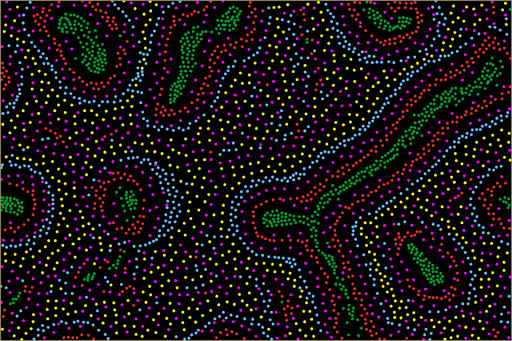
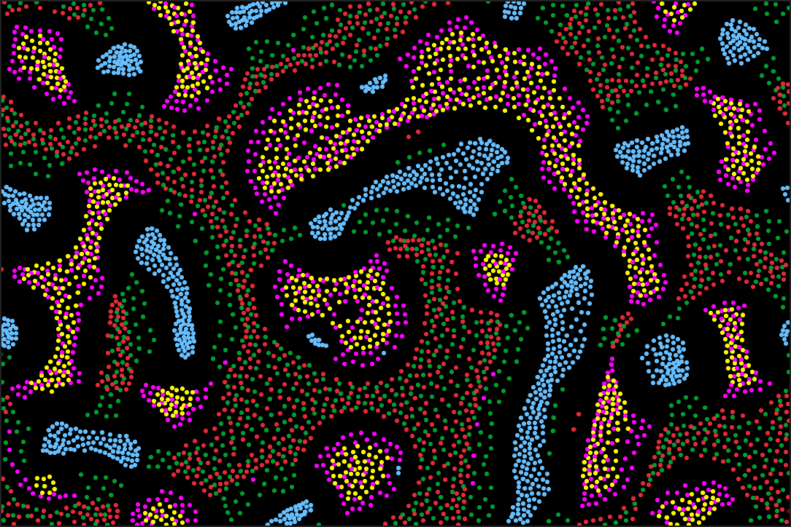
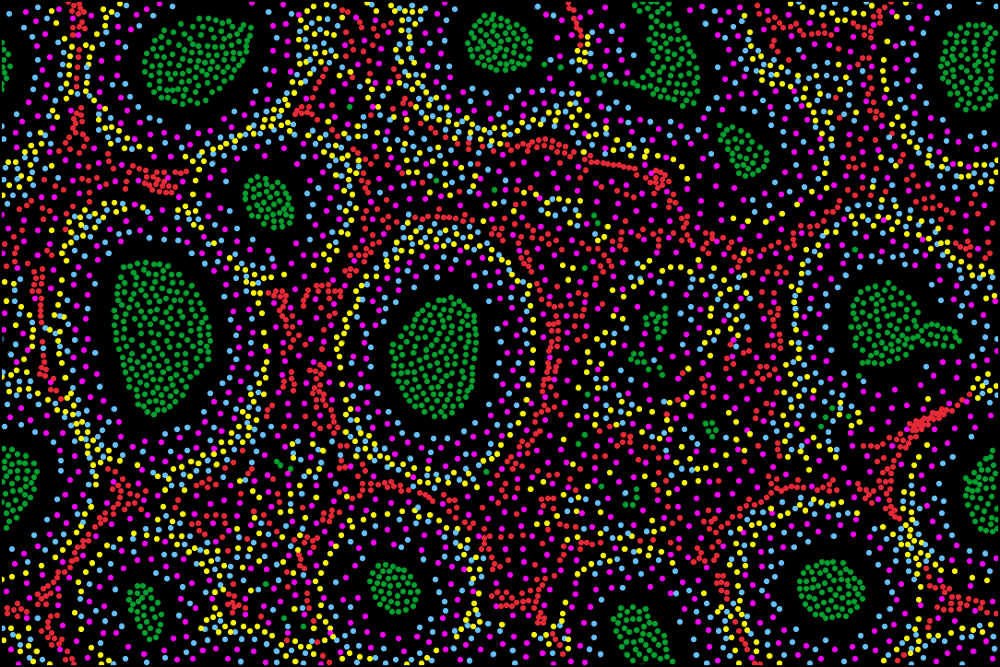
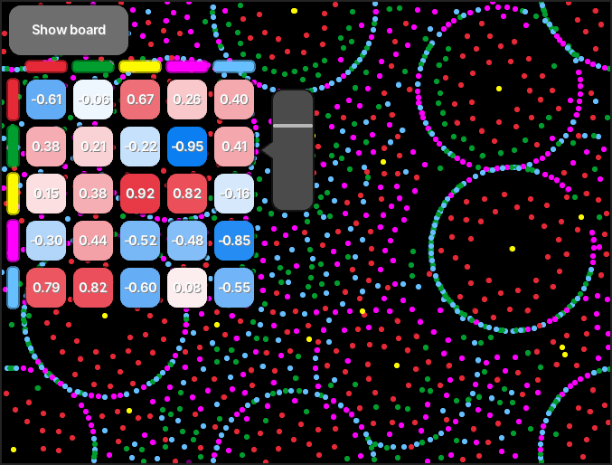

# C++2 Syntax Experiment Project - Multiple Neighborhoods Cellular Automata


## Description

Simple proof-of-concept / learning project of a visualization of multiple neighborhoods cellular automata (MNCA) written in experimental [Cpp2 Syntax](https://github.com/hsutter/cppfront/) (designed by Herb Sutter).

It utilises custom immediate mode UI, basic multithreading simulation, embedding data in Cpp2 files and visualisation using [Raylib](https://raylib.com/) as a drawing library.

## Dependencies
- Any popular C++20 compiler
- GNU make
- Git

## Build
```bash
make
```

## Build manually
1. Compile cppfront (commit hash d59ef7c).
2. Translate and compile utils/file2cpp2.cpp2 tool and use it to package fonts from resources/ into a src/font_data.h2 file.
3. Translate and compile .h2 and .cpp2 files from src/ directory.
3. Link compiled objects together with Raylib 5.0 library.

## Run
```bash
./mnca
```

## Screenshots



## License
MIT License (see [LICENSE](./LICENSE) file)
